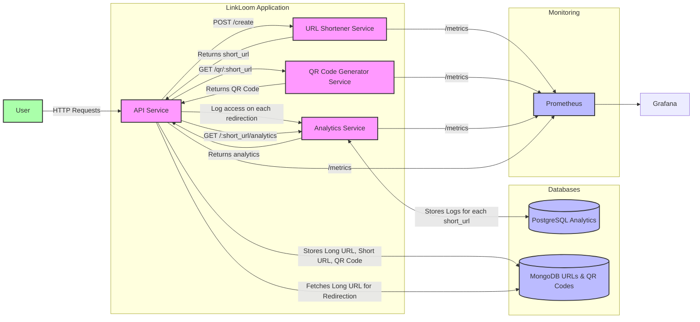

# LinkLoom🔗

LinkLoom is a microservice application designed to manage URLs, providing URL shortening, QR code generation, analytics logging, and an integrated API service. These services are loosely coupled, and the application is deployed on a local Kubernetes cluster using Minikube (due to the cost considerations of EKS 😅). Helm is utilized to manage deployments of MongoDB and PostgreSQL, alongside Prometheus and Grafana for monitoring purposes. CI/CD pipeline is implemented using GitHub Actions to automate build, test, and deployment processes.

🎥 Watch the full project setup here: https://youtu.be/UUu3EVSBkLc

[](https://skillicons.dev)

## Architecture Overview:


## Components:

1. **URL Shortener Service** (Flask)
   - **Description:** Provides functionality to shorten URLs, supporting custom short URLs.
   - **Endpoint:** `/shorten`
   - **Docker Image:** `docker.io/prajjwalyd/url-shortener`

2. **QR Code Generator Service** (Golang)
   - **Description:** Generates QR codes for given URLs.
   - **Endpoint:** `/generate_qr`
   - **Docker Image:** `docker.io/prajjwalyd/qr-code-generator`

3. **Analytics Service** (Flask)
   - **Description:** Logs analytics data (access time, IP, user agent, referrer) into a PostgreSQL database.
   - **Endpoints:** 
     - `/log` (for logging access)
     - `/<short_url>/analytics` (to retrieve analytics for a given short URL)
   - **Docker Image:** `docker.io/prajjwalyd/analytics`

4. **API Service** (Flask)
   - **Description:** Integrates all services, manages URL mappings and QR codes, stores data in MongoDB, and provides unified endpoints.
   - **Endpoints:** 
     - `/create` (to create a shortened URL and optionally generate QR code)
     - `/<short_url>` (to redirect to the original long URL)
        - It logs data whenever a short url is accessed by sending a POST request to the Analytics service. 
     - `/qr/<short_url>` (to retrieve QR code)
     - `/<short_url>/analytics` (to fetch analytics data)
   - **Docker Image:** `docker.io/prajjwalyd/api`

**Prometheus Metrics Endpoint:** Each service exposes `/metrics`.

5. **Databases**
   - **MongoDB:** Stores URL mappings and QR codes.
     - Helm Deployment: `my-mongo`
   - **PostgreSQL:** Stores analytics data.
     - Helm Deployment: `my-postgresql`

6. **Monitoring**
   - **Prometheus:** Collects metrics from each service.
     - Helm Deployment: `prometheus`
   - **Grafana:** Visualizes metrics and provides dashboards.
     - Helm Deployment: `grafana`
    


## Setup and Deployment:

For the quickest and easiest way to get the app running, I recommend setting it up in a GitHub Codespace. 

> **How to set up on Codespaces?**
> Watch this video: https://youtu.be/UUu3EVSBkLc


#### Local Kubernetes Cluster Setup (Minikube):
[Minikube installation guide](https://minikube.sigs.k8s.io/docs/start/)
   ```
   minikube start
   ```

#### Helm:
[Helm installation guide](https://helm.sh/docs/intro/install/)
```
helm repo add bitnami https://charts.bitnami.com/bitnami
helm repo add prometheus-community https://prometheus-community.github.io/helm-charts
helm repo add grafana https://grafana.github.io/helm-charts
helm repo update
```

#### Deploy Databases:
```
helm install my-mongo bitnami/mongodb --set auth.rootPassword=example,auth.username=root,auth.password=example,auth.database=url_db
helm install my-postgresql bitnami/postgresql -f values.yaml
```

#### Deploy Services:
Apply Kubernetes manifests (`k8s/` directory)
```
kubectl apply -f k8s
```

#### Deploy Prometheus and Grafana:
```
helm install prometheus prometheus-community/prometheus -f prometheus.yml
helm install grafana grafana/grafana
```

#### Verify Deployment:
```
kubectl get pods
kubectl get svc
```

#### Access Prometheus and Grafana:
- Forward ports:
    ```
    kubectl port-forward deploy/prometheus-server 9090
    kubectl port-forward deploy/grafana 3000
    ```
- Prometheus: `http://localhost:9090`
- Grafana: `http://localhost:3000`
    Login with username `admin` and retrieve your password using:
    ```
    kubectl get secret --namespace default grafana -o jsonpath="{.data.admin-password}" | base64 --decode ; echo
    ```

#### Set Up Grafana Data Source:
Add Prometheus data source in Grafana with URL `http://prometheus-server.default.svc.cluster.local:80`

#### Import Dashboard:
Import the provided [JSON dashboard](https://github.com/prajjwalyd/LinkLoom/blob/main/LinkLoom-grafana.json) file for metrics visualization.


## Testing Endpoints:
- Find your Minikube IP:
```
minikube ip
```
- Expose the API service:
```
kubectl port-forward service/api 30000:5000
```
- curl commands:
```
# Replace `http://192.168.49.2` with your minikube IP

# Creating a short url:
curl http://192.168.49.2:30000/create -X POST -H "Content-Type: application/json" -d '{"long_url": "http://example.com"}'

# Crating a custom short url:
curl -X POST http://192.168.49.2:30000/create -H "Content-Type: application/json" -d '{"long_url": "https://example.com", "custom_url": "mycustomurl"}'

# Creating a short url with QR Code:
curl -X POST http://192.168.49.2:30000/create -H "Content-Type: application/json" -d '{"long_url": "https://example.com", "custom_url": "custom123", "generate_qr": true}'

# Retreive the QR Code and save it as PNG:
curl -X GET http://192.168.49.2:30000/qr/custom123 --output qr_code.png

# Test the redirection
curl -L http://192.168.49.2:30000/custom123

# Access the analytics
curl -X GET http://192.168.49.2:30000/custom123/analytics
```
